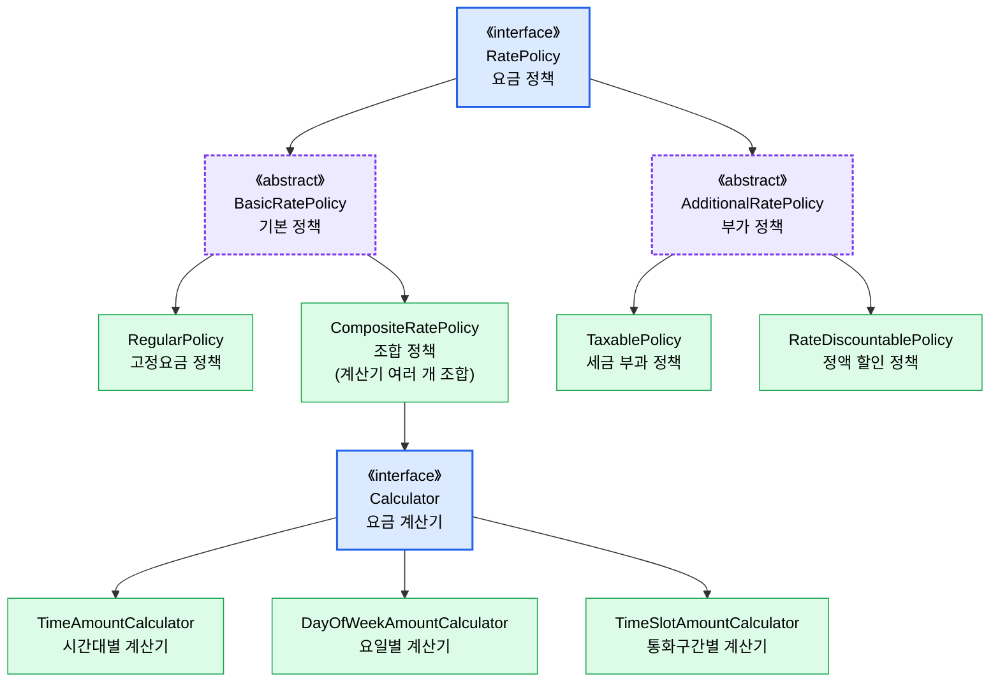

# 프로젝트 구조 다이어그램

```mermaid
graph TD
    Policy["《interface》<br/>RatePolicy<br/>요금 정책"]

    Basic["《abstract》<br/>BasicRatePolicy<br/>기본 정책"]
    Additional["《abstract》<br/>AdditionalRatePolicy<br/>부가 정책"]

    Regular["RegularPolicy<br/>고정요금 정책"]
    Composite["CompositeRatePolicy<br/>조합 정책<br/>(계산기 여러 개 조합)"]

    Tax["TaxablePolicy<br/>세금 부과 정책"]
    Disc["RateDiscountablePolicy<br/>정액 할인 정책"]

    Calc["《interface》<br/>Calculator<br/>요금 계산기"]
    TC["TimeAmountCalculator<br/>시간대별 계산기"]
    DC["DayOfWeekAmountCalculator<br/>요일별 계산기"]
    SC["TimeSlotAmountCalculator<br/>통화구간별 계산기"]


    Policy --> Basic
    Policy --> Additional

    Basic --> Regular
    Basic --> Composite

    Additional --> Tax
    Additional --> Disc

    Composite --> Calc
    Calc --> TC
    Calc --> DC
    Calc --> SC

    classDef iface fill:#dbeafe,stroke:#2563eb,stroke-width:2px,color:#000;
    classDef abs fill:#ede9fe,stroke:#7c3aed,stroke-width:2px,stroke-dasharray:4 2,color:#000;
    classDef concrete fill:#dcfce7,stroke:#16a34a,color:#000;
    classDef root fill:#fef3c7,stroke:#d97706,stroke-width:2px,color:#000;

    class Policy,Calc iface;
    class Basic,Additional abs;
    class Regular,Night,Composite,Tax,Disc,TC,DC,SC concrete;
    class Fee root;
```

## 범례

| 표기 | 의미 | 색상 |
|---|---|---|
| 《interface》 | 인터페이스 | 🟦 파랑 |
| 《abstract》 | 추상 클래스 (점선 테두리) | 🟪 보라 |
| (없음) | 일반(구체) 클래스 | 🟩 초록 |